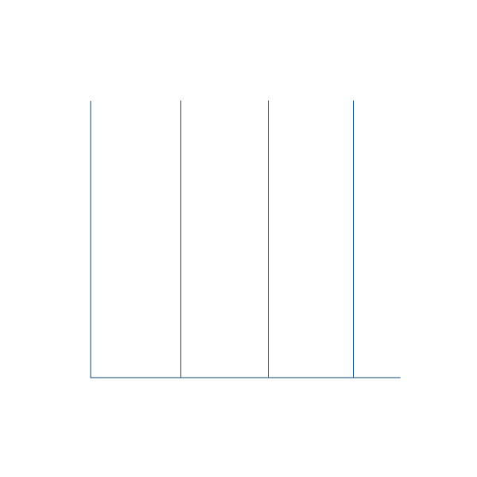

<div align="center">
  <!-- Typing SVG Banner -->
  
</div>

<p align="center">
  <a href="https://github.com/nzl404">
    
  </a>
</p>

<h3 align="center">🎯 Management Student | Casual Coder | JKT48 Fanboy</h3>

<p align="center">
  <!-- Profile Views Fix using pure Markdown to prevent HTML parser errors -->
  
  &nbsp;
  <!-- Followers -->
  
</p>

<div align="center">
  
</div>

<!-- ================= CONNECT WITH ME ================= -->
<h2 align="center"> Connect with me</h2>
   
<p align="center">
  <a href="https://instagram.com/firdauss4_" target="_blank">
    
  </a>
  <a href="https://t.me/zoyevernight" target="_blank">
    
  </a>
  <a href="https://www.tiktok.com/@firdauss4_" target="_blank">
    
  </a>
  <a href="https://line.me/ti/p/~firdauss4" target="_blank">
    
  </a>
  <a href="https://www.reddit.com/u/Firdaus404" target="_blank">
    
  </a>
  <a href="https://wa.me/6282139311790" target="_blank">
    
  </a>
</p>

<div align="center">
  
</div>

<!-- ================= ABOUT ME ================= -->
<h2 align="center"> About Me</h2>

<p align="center">
  
</p>

```
🎓  Management student who loves coding casually as a hobby
☕  Passionate about gaming, drinking coffee, and sleeping
⭐  Indonesian JKT48 fan (FJKT48)
```

<!-- ================= JKT48 FAVORITES ================= -->
<h3 align="center">✨ Favorite Oshi</h3>
<p align="center">
  <strong>Marsha Lenathea</strong> (9th Generation)<br/>
  and<br/>
  <strong>Freya Jayawardana</strong> (7th Generation)
</p>

<div align="center">
  
</div>

<!-- ================= TECH STACK ================= -->
<h2 align="center">🛠️ Tech Stack</h2>

<details open>
  <summary><strong>🔤 Languages</strong></summary>
  <br/>
  <p align="left">
    
    
    
  </p>
</details>

<details open>
  <summary><strong>🌐 Web Development</strong></summary>
  <br/>
  <p align="left">
    
    
  </p>
</details>

<details open>
  <summary><strong>🗄️ Databases</strong></summary>
  <br/>
  <p align="left">
    
    
  </p>
</details>

<details open>
  <summary><strong>🔧 Tools and Platforms</strong></summary>
  <br/>
  <p align="left">
    
    
    
    
    
  </p>
</details>

<details open>
  <summary><strong>📝 Code Editors and IDEs</strong></summary>
  <br/>
  <p align="left">
    
    
    
  </p>
</details>

<div align="center">
  
</div>

<!-- ================= GITHUB STATS ================= -->
<h2 align="center"> GitHub Statistics</h2>

<div align="center">
  
  
</div>

<br/>

<div align="center">
  <!-- Footer Typing SVG -->
  
</div>
